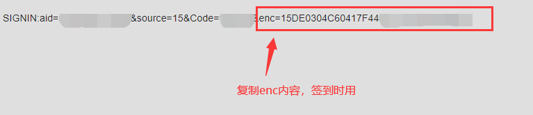

<h1 align="center">⏰超星学习通签到⏰</h1>
<p align="center">
  =v8.5.4-brightgreen.svg" />
</p>

基于 Nodejs ，实现的一个签到命令行工具。为了节约性能，只对开始2小时以内的活动签到。特殊情况：同一时间有多个有效签到活动的话，只签最新的。

**功能**： 普通签到、拍照签到、手势签到、位置签到、签到码签到、二维码签到（10秒变换不影响），多用户凭据储存（多开）。

**注意**： 本程序仅为交流学习使用，借助学习通的平台，通过本项目加深http请求、网络通信、接口编写、交互设计等方面知识的理解，请勿用作商业以及其他用途。

**为确保你的代码最新与仓库保持同步，将在每次签到结束强制拉取代码更新**，如需关闭更新，请查看[issue2](https://github.com/miaochenxi/chaoxing-sign-cli/issues/2#issuecomment-962781427)。手动终止检查更新可在每次检查时按下 `Ctrl`+`C` 并确认终止，更多功能正在开发 ...

## 环境 💻

可在任意运行 [NodeJS](https://nodejs.org/en/) > v8.5.4 的平台签到，Windows、MacOS、Linux ... 

安卓手机上可以用 Termux 来运行NodeJS程序，[查看Termux教程](./src/docs/termux.md) 。

苹果手机请查看 [高级](https://github.com/miaochenxi/chaoxing-sign-cli#%E9%AB%98%E7%BA%A7-) 部分，通过这种方式来使用，当然这种方式也适用于其他。

## 部署 🛠

将仓库克隆到本地

```bash
git clone https://github.com/miaochenxi/chaoxing-sign-cli.git
```

进入项目文件夹

```bash
cd chaoxing-sign-cli
```

## 运行 ⚙

执行以下命令即可

```bash
npm start
```

## 使用须知 📄

### 二维码签到

在运行之前需要做些准备，请找一位挚友，发来拍的二维码的照片（无所谓几秒一变），用微信扫一扫二维码，或用其他工具识别，得到类似下面的结果：



复制其中的 `enc` 参数，注意不要复制多余内容和空格，例如 1D0A628CK317F44CCC378M5KD92，复制该值，询问时填入。

### 位置签到

根据运行时的提示输入**经纬度**和**详细地址**，经纬度可在这里自己获取 [百度拾取坐标系统](https://api.map.baidu.com/lbsapi/getpoint/index.html)，点击某位置，经纬度将出现在网页右上方，复制该值，询问时填入。详细地址样例：中国河南省郑州市中原区沟赵乡红松路郑州轻工业大学(科学校区)，该地址将显示在教师端。

### 拍照签到

需要事先准备一张用来提交的照片。浏览器访问超星云盘：https://pan-yz.chaoxing.com ，在根目录上传一张你准备的照片，命名为 `0.jpg` 或 `0.png` 。

### 普通签到&手势签到&签到码签到

没有任何需要准备的，直接运行即可。

## 高级 🎲

以上内容介绍了最基本的用法，接下来介绍一些稍高级一些的使用方法。

### 运行接口服务

首先运行 `npm install` 或者 `yarn`，安装依赖。

运行 `npm run serve` 将启动接口服务，可通过调用 API 来实现以上功能。接下来描述每个接口的参数以及调用方式：

|路径|请求方式|参数|内容类型|返回内容|
|-|-|-|-|-|
|/|GET|无|无|待填|
|/login|POST|phone, password|JSON|待填|
|/activity|POST|uf, _d, vc3, _uid|JSON|待填|
|/qrcode|POST|uf, _d, vc3, name, aid, _uid, fid, enc|JSON|待填|
|/location|POST|uf, _d, vc3, name, aid, _uid, fid, address, lat, lon|JSON|待填|
|/general|POST|uf, _d, vc3, name, aid, _uid, fid|JSON|待填|
|/photo|POST|uf, _d, vc3, name, aid, _uid, fid|JSON|待填|

### 图形化界面

基于 React.js + Material UI 开发前端页面，其中修改了很多 MUI 附带样式，也自己手写了一些，整体设计灵感-->拟态。

访问 [这里](https://github.com/miaochenxi/chaoxing-sign-ui) 查看图形化客户端具体内容。

基本使用步骤：
1. 将两个项目依赖都装好
2. 在本项目运行 `npm run serve` 或 `yarn serve`
3. 在 UI 项目(与本仓库分离)运行 `npm start` 或 `yarn start`
4. 未作任何修改的情况下，可通过 http://localhost:3000 通过网页使用全部功能

不过我的建议是，构建一下页面，然后部署到服务器自己学习用。


> 可在 Termux 或服务器上配置并部署 `接口服务` 和 `前端页面`， 运行两者，获得最佳体验。


## 贡献

欢迎对本仓库提交代码，但是在这之前请发起一个Issue描述你想要修改或提供的功能，经过讨论之后再确定是否进行下去，避免辛苦写完代码最终没有得到合并。本项目按照个人意愿进行开发，一些功能以及设计带有个人主观的想法，所以有想法要提交代码的朋友请一定先讨论一下。

## 鸣谢

非常感谢超星学习通，实践出真知。
