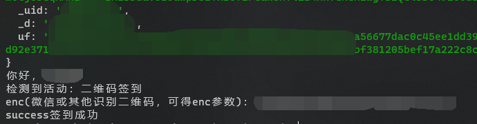

<h1 align="center">超星学习通签到</h1>
<p align="center">
  =v8.5.4-brightgreen.svg" />
</p>

基于 Nodejs ，实现的一个签到命令行工具。为了节约性能，只对开始一小时以内的活动签到。特殊情况：同一时间有两个签到活动（一般也不会同时上两个课吧），将只签最新课程的。

**功能**： 位置签到、二维码签到（10秒变换也可用）。

更多功能正在开发 ...

## 环境 💻

可在任意运行 Nodejs > v8.5.4 的平台签到，Windows、MacOS、Linux，安卓可以安装 Termux 并配置 [Nodejs](https://nodejs.org/en/) 。

## 部署 🛠

将仓库克隆到本地

```bash
git clone https://github.com/***REMOVED***/chaoxing-sign-cli.git
```

进入项目文件夹

```bash
cd chaoxing-sign-cli
```

## 运行 ⚙

### 二维码签到

运行以下命令

```bash
npm run code
```

在这之前你需要做些准备，请找一位同学，发来拍的二维码的照片（无所谓几秒一变），用微信扫一扫二维码，或用其他工具识别，得到类似下面的结果：


复制其中的 `enc` 参数，注意不要复制多余内容和空格，例如 1D0A628CK317F44CCC378M5KD92，复制完成后运行时用得到。

### 位置签到

运行以下命令

```bash
npm run loc
```

根据提示输入**经纬度**和**详细地址**，经纬度可在这里自己获取 [百度拾取坐标系统](https://api.map.baidu.com/lbsapi/getpoint/index.html)，点击某位置，经纬度将出现在网页右上方，复制等需要的时候使用。详细地址样例：中国河南省郑州市中原区沟赵乡红松路郑州轻工业大学(科学校区)。当然你也可以随便写，不过，老师看着奇怪点你名就没办法了╮(╯▽╰)╭

## 截图



## 鸣谢

毛概老师。