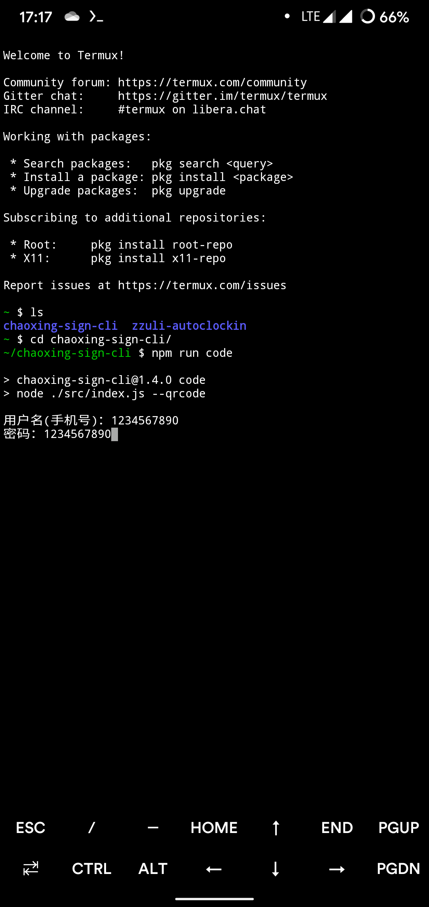

# Termux 运行 NodeJS 程序

首先安装 Termux，你可以在 [F-droid商店](https://f-droid.org/) 下载安装，也可以从网上寻找安装包进行安装。

安装完成后，打开 Termux 。

运行以下命令，更新源和系统，中途可能需要确认输入 `y`

```bash
apt-get update && apt-get upgrade
```

完成以后关闭 Termux，请保证进程完全退出，再打开。更新完不关闭再重新打开可能会莫名其妙的安装失败。

运行下面命令安装 NodeJs 和 Git

```bash
pkg install nodejs-lts git
```

完成后，如果安装成功，在 Termux 中输入 `node -v` 将显示安装的 Node 版本。

此时，Node环境已经配置好。之后的步骤就是拉取项目，运行项目了，请回到[主页](https://github.com/***REMOVED***/chaoxing-sign-cli)查看如何操作。

## 截图

